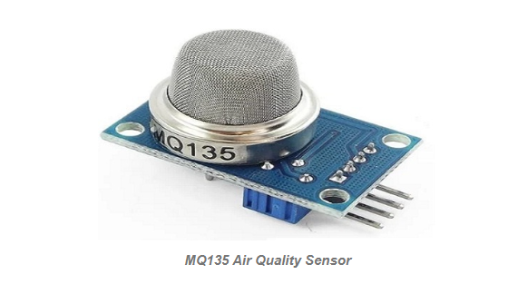
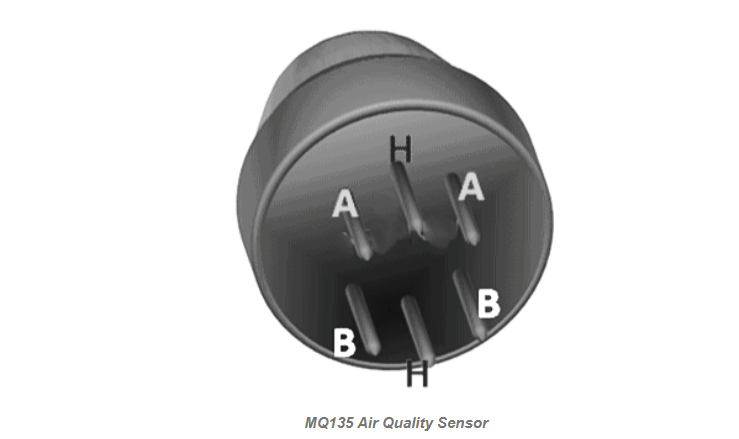

# MQ135 AIR QUALITY SENSOR 
A device that is used to detect or measure or monitor the gases like ammonia, benzene, sulfur, carbon dioxide, smoke, and other harmful gases are called as an air quality gas sensor. The MQ135 air quality sensor, which belongs to the series of MQ gas sensors, is widely used to detect harmful gases, and smoke in the fresh air.  

An MQ135 air quality sensor is one type of MQ gas sensor used to detect, measure, and monitor a wide range of gases present in air like ammonia, alcohol, benzene, smoke, carbon dioxide, etc. It operates at a 5V supply with 150mA consumption.  Preheating of 20 seconds is required before the operation, to obtain the accurate output.

It is a semiconductor air quality check sensor suitable for monitoring applications of air quality. It is highly sensitive to NH3, NO2, CO2, benzene, smoke, and other dangerous gases in the atmosphere. It is available at a low cost for harmful gas detection and monitoring applications.  

If the concentration of gases exceeds the threshold limit in the air, then the digital output pin goes high. The threshold value can be varied by using the potentiometer of the sensor. The analog output voltage is obtained from the analog pin of the sensor, which gives the approximate value of the gas level present in the air  
___
### Pin Configuration:
The MQ135 air quality sensor is a 4-pin sensor module that features both analog and digital output from the corresponding pins. The MQ135 air quality sensor pin configuration is shown below.

Pin 1:  
 VCC: This pin refers to a positive power supply of 5V that power up the MQ135 sensor module.

Pin 2:  
 GND (Ground): This is a reference potential pin, which connects the MQ135 sensor module to the ground.

Pin 3:  
 Digital Out (Do): This pin refers to the digital output pin that gives the digital output by adjusting the threshold value with the help of a potentiometer. This pin is used to detect and measure any one particular gas and makes the MQ135 sensor work without a microcontroller.

Pin 4:  
 Analog Out (Ao): This pin generates the analog output signal of 0V to 5V and it depends on the gas intensity. This analog output signal is proportional to the gas vapor concentration, which is measured by the MQ135 sensor module. This pin is used to measure the gases in PPM. It is driven by TTL logic, operates with 5V, and is mostly interfaced with microcontrollers.
___
### MQ135 Air Quality Sensor :

H-pins:   
There are 2 H-pins, where one is connected to the voltage supply and the other is connected to the ground.

A-pins:   
Here A-pins and B-pins can be interchanged. These are connected to the voltage supply.

B-pins:  
 Here A-pins and B-pins can be interchanged. One pin is used to generate output while the other pin is connected to the ground.  
 ____
### Working
The MQ-135 uses a heated tin dioxide (SnO₂) sensing layer to detect gases.
A built-in heater keeps the sensor at high temperature for proper reaction.
In clean air, oxygen molecules increase the sensor’s resistance.
When harmful gases are present, they react with oxygen and reduce resistance.
The change in resistance produces a change in output voltage.
This voltage is read by a microcontroller to estimate air quality
_____

### Advantages:

* Detects Multiple Gases :   
It can detect gases like ammonia (NH₃), nitrogen oxides (NOx), alcohol, benzene, smoke, and carbon dioxide (CO₂).

* Low Cost :  
It is inexpensive and easily available, making it suitable for student projects and IoT applications.

* Easy to Interface :  
Can be easily connected with microcontrollers like Arduino, Raspberry Pi, and other embedded systems.

* Analog and Digital Output :  
Provides both analog output (for measuring concentration) and digital output (threshold-based detection).

### Disadvantages :

* Low Accuracy :   
It does not give precise gas concentration values compared to professional gas sensors.

* Sensitive to Temperature & Humidity :  
Environmental conditions can affect readings.

* High Power Consumption :  
Uses a built-in heater element, which consumes more power.

* Poor Selectivity :  
Cannot clearly distinguish between different gases; responds to multiple gases at once.

