# LEVEL-0-REPORT
# TASK 1 : API
* An API (Application Programming Interface) is a set of rules that allows different software applications to communicate with each other.
* It enables one program to request and use data or services from another program.  
* I developed an API-based web application called “Know Your Book.” This application allows users to enter a book name and retrieve important details about the book. It uses the Google Books API to fetch real-time data. The application displays the book’s title, author, genre, published date, and ratings. 
* The project is built using JavaScript and the fetch() method to handle API requests and responses.   

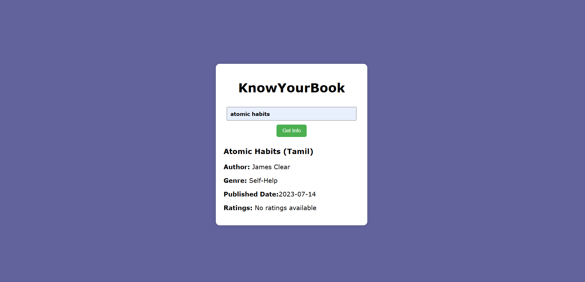
-----
# TASK 2 : WORKING WITH GITHUB
* GitHub is an online platform used to store, manage, and share code using Git version control. It helps developers collaborate, track changes, and work on projects together from anywhere.  
 * I visited the given repository and read the instructions in README file, then i forked the repository and cloned it , created a branch and made changes in the code , pushed the changes to github and pulled request.  
 * Through this task, I gained practical knowledge of version control, collaboration, and GitHub workflow management.

  
___
# TASK 3 : GET FAMILIAR WITH COMMAND LINES IN UBUNTU
In this task i learned basic ubuntu commands like,  
* mkdir - used to create new folder  
* cd - used to change directories  
* ls - list files and folders in the current directory  
* touch - create a new empty file  
* for i in $(seq 1 2600); do mkdir "M$i"; done - creates 2600 folders named M1 to M2600  
* echo - used to write text into a file  
* cat- used to concatinate(join) to files and display the output in the terminal  

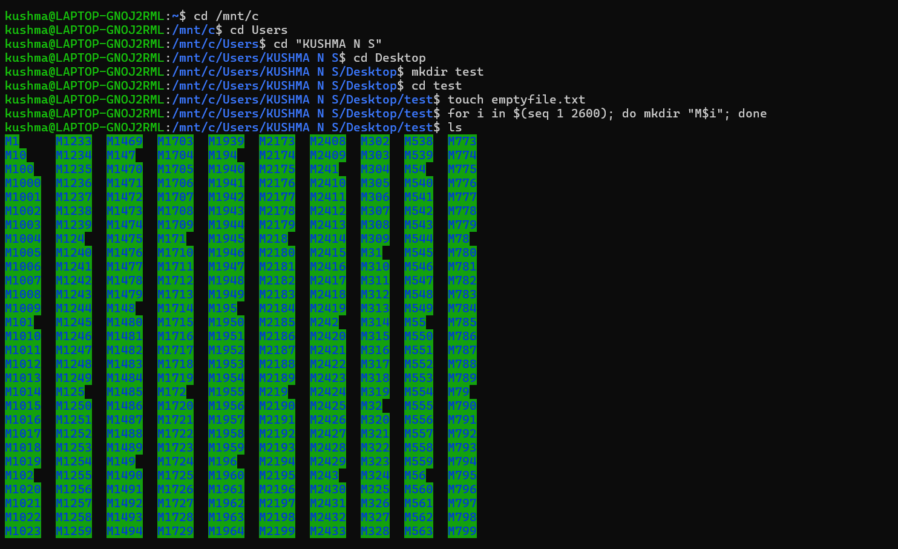  
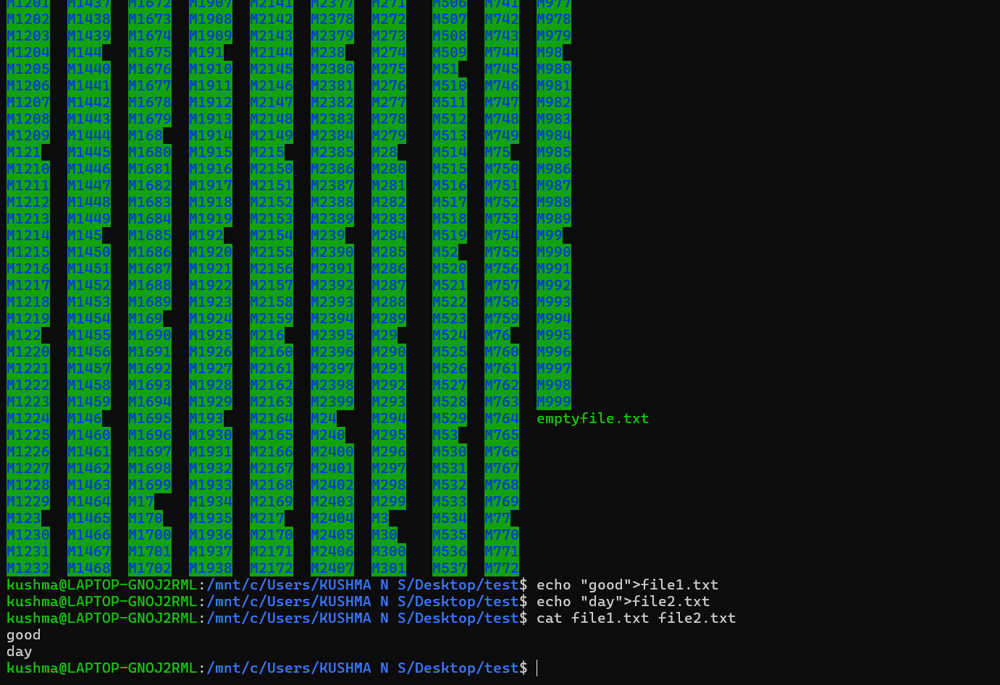  
___
# TASK 4 : CREATE PORTFOLIO WEBPAGE
I created a personal portfolio website using HTML and CSS.  
 The website showcases information about me, my education, skills, experience and social media profiles.  
 

  
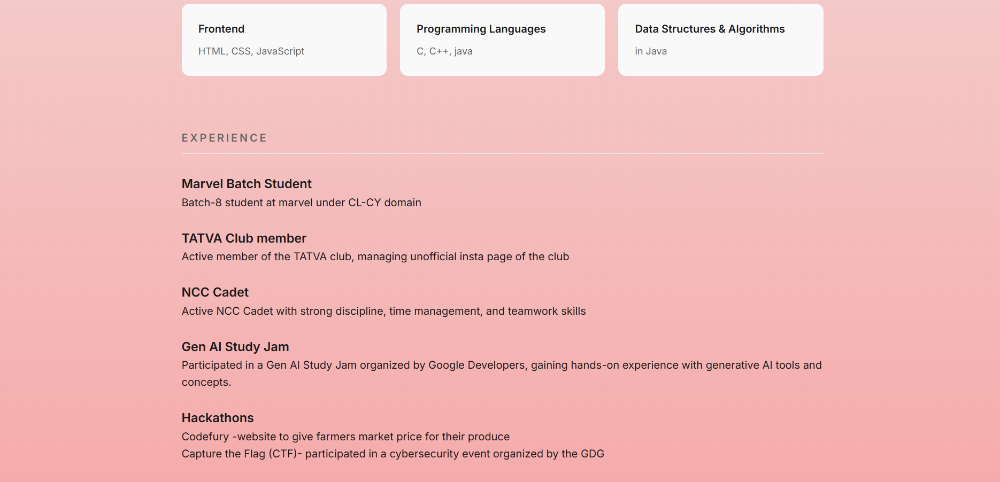  
____

# TASK 5 : WRITING RESOURCE ARTCLE USING MARKDOWN
* In this task , I wrote an resource article using Markdown.Markdown is a simple markup language that allows formatting text without HTML  
* My article is about Social media algorithms , explaining their importance, working, potential downsides and ways to stay ahead of algorithms.  
* I used headings, lists, tables and links in Markdown to structure the content clearly and make it easy to read.  
link to report :
[Social media algorithms](algorithm.md)  
_____
# TASK 6 : TINKERCARD
Tinkercad is an online 3D design and modeling tool that is used to create 3D objects, circuits, and simulations easily using a web browser. It allows you to build virtual electronic circuits, test them, and supports microcontrollers  without needing physical components.   
I created Audrino-based ultrasonic distance measurement system using Audrino uno, HC-SR04 Ultrasonic Sensor, server motor and jumper wires. 

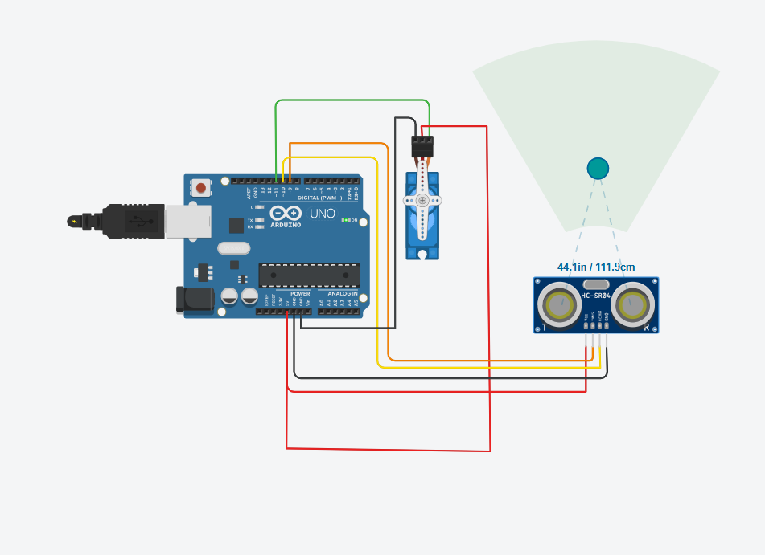
_____
# TASK 7 : LED TOGGLE USING ESP32
ESP32 is a Wi-Fi and Bluetooth-enabled microcontroller used in electronics projects.  
In this task, I learned the working of the ESP32 and created a standalone web server using it. The web server allows control of an LED connected to the ESP32 GPIO pins through a web interface. I used the Arduino IDE to write and upload the code to the ESP32, and learned how to configure the IDE to recognize and program the ESP32 board. 

[led toggle video](ledoggle.mp4)
_____
# TASK 8 : SOLDERING PREREQUISITES
* Soldering : Soldering is the process of joining two or more metal parts together by melting a filler metal called solder into the joint.
* Desoldering : Desoldering is the process of removing solder to detach components from a circuit board, usually for repair or replacement.
* Flux : Flux is a chemical cleaning agent used during soldering. It removes oxides and impurities from metal surfaces to help solder flow smoothly and make a strong, clean connection.  

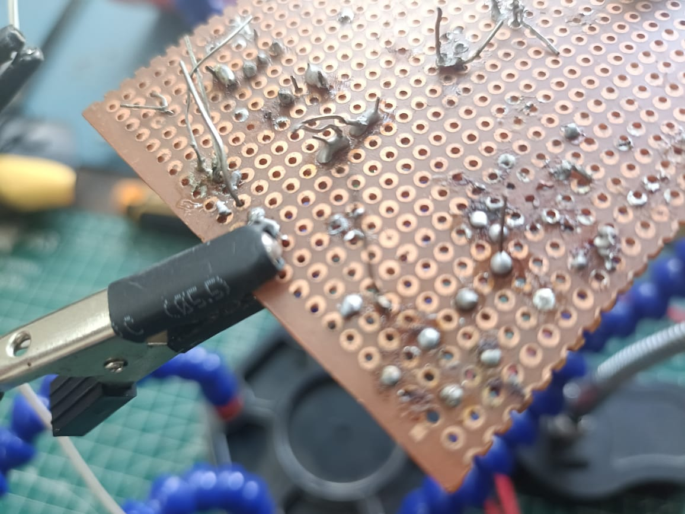

____
# TASK 9 : KARNAUGH MAPS AND DERIVING THE LOGIC CIRCUIT
* Karnaugh Maps (K-Maps) are used to simplify Boolean expressions in digital logic design.  
* In this task, I designed a logic circuit for a burglar alarm system using K-Maps. 
* The system considers four input cases: door open/closed and key pressed/not pressed and two output cases: alarm is on/off .   
* The circuit was then implemented using basic logic gates.  
* This task helped me understand Boolean simplification, K-Maps, and practical digital logic circuit design.

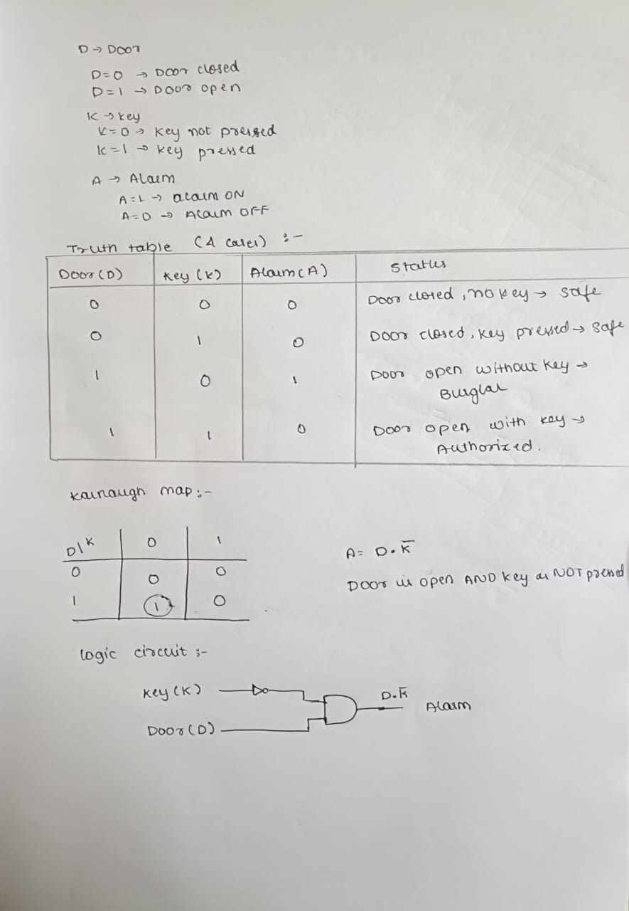
____
# TASK 10 :SAD SERVERS-"LIKE LEETCODE FOR LINUX"
Sadservers is an online platform for practicing Linux troubleshooting skills.  
In this task, there was a challenge called Command Line Murders on the Sadservers platform with time limit of 20 mins. The challenge involved using the Linux commands to explore folders, inspect files, and find clues to solve a mystery.   

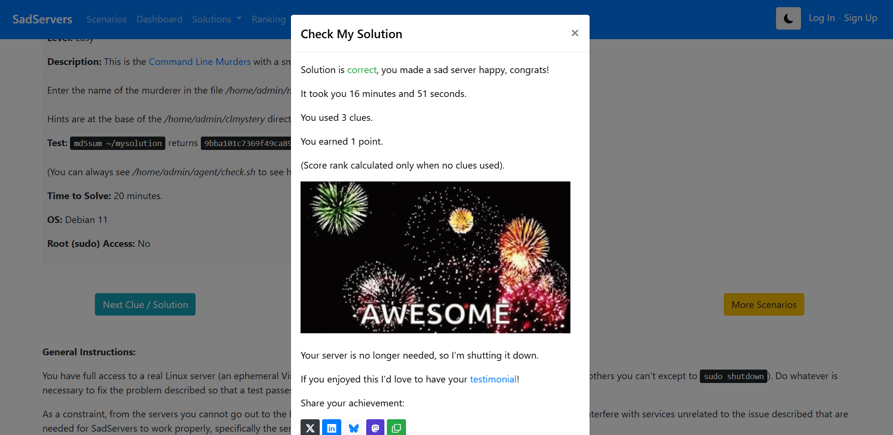
_____

# TASK 11 : SPEED CONTROL OF DC MOTOR
In this task, I controled DC motor speed using an Arduino UNO and an L298N H-Bridge motor driver. I learned how to control the speed and direction of a 5V DC motor by varying the PWM signals from the Arduino.  
L298N H-Bridge motor driver is used to control DC motors with an Arduino or other microcontrollers.(Control the direction of the motor, Control the speed of the motor using PWM signals)  
This task helped me understand PWM-based motor speed control, H-Bridge operation, and practical electronics skills.

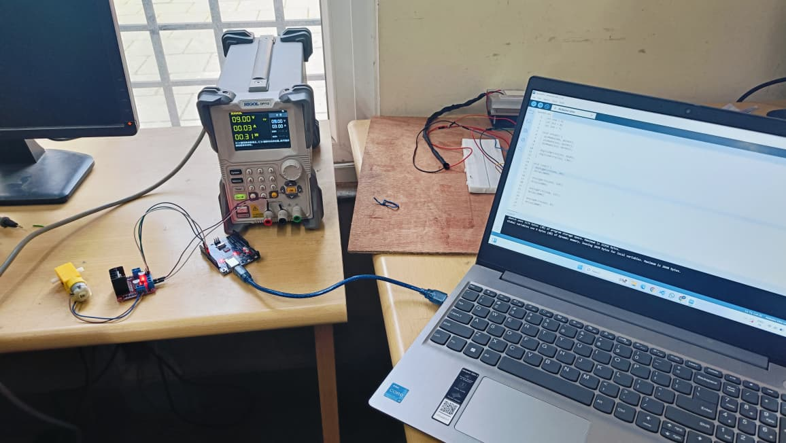

[dc motor speed control](task11.mp4)
_________

# TASK 12 : 3D PRINTING
* 3D Printing: A process of creating a physical object layer by layer from a digital 3D model using a 3D printer.
* STL File: A standard file format for 3D models, which contains the surface geometry of the object to be printed.
* Slicing: The process of converting a 3D model (STL file) into instructions (G-code) that the printer can follow.
* Bed Temperature: The temperature of the printer’s build platform, which helps the first layer of the print stick properly.
* Infill Density: The amount of material inside the printed object, affecting its strength and weight.
* Printer Settings: Parameters like speed, temperature, layer height, and support structures that determine the quality and success of the print.

________

# TASK 13 : VIRTUAL REALITY
* Virtual Reality (VR) is the use of computer technology to create a simulated environment.Virtual reality places the user inside a three-dimensional experience. Instead of viewing a screen in front of them, users are immersed in and interact with 3D worlds.  
* Augmented reality(AR) overlays video or images onto a display of the physical world, typically through a smartphone. The overlaid image creates an interaction between the user and the digital and physical worlds, allowing them to make connections or have new experiences  
link to report:
[Virtual reality](VR.MD)
__________

# TASK 14 : MAKE A WEB APP
I made an app "FLOWER GARDEN", which allows users to draw flowers on digital canvas using different colours and eraser . After completing their drawings, users can name the flower and save it . This application is developed using HTML, CSS and JavaScript .  

_______

# TASK 15 : BUILD YOUR OWN BRAIN-LINEAR REGRESSION FROM SCRATCH
* Linear Regression is one of the most fundamental supervised learning algorithms used for predicting continuous values. The objective is to find the best-fitting line that minimizes prediction error.  
*  Gradient Descent is an optimization algorithm used to minimize a function by iteratively moving toward the smallest value of that function. 
* Cost function is a mathematical function that measures the error between predicted values and actual values.  
* In Linear Regression, the most common cost function is Mean Squared Error (MSE).
*  MSD is the average of the squared differences between actual and predicted values. 
* Observations made from the graph :

  * Blue dots → Actual housing data  
  * Solid blue line → Custom model prediction  
  * Orange dashed line → Scikit-learn prediction
  

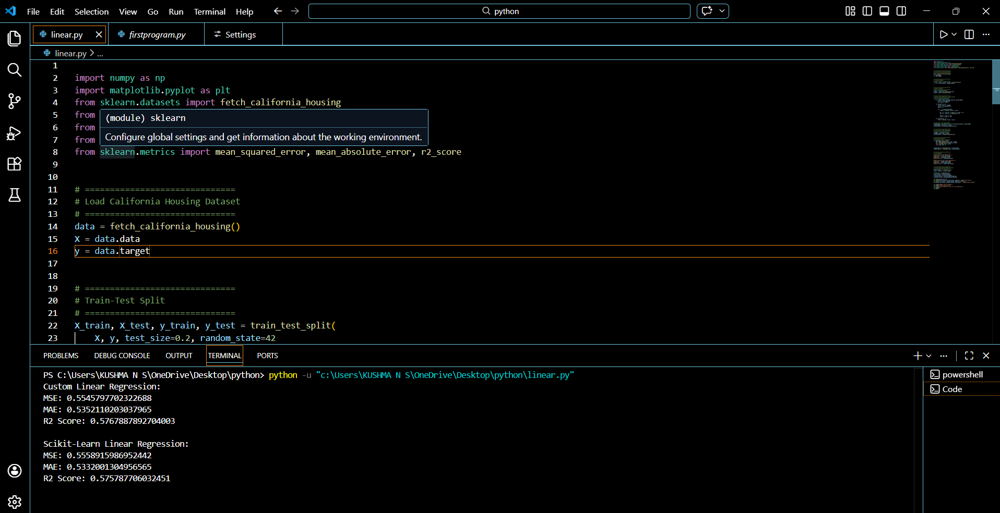

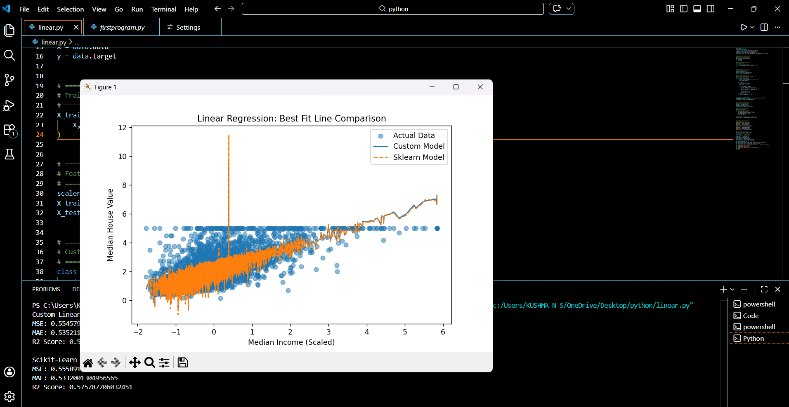
__________
# TASK 16 : MQ135 AIR QUALITY SENSOR
An MQ135 air quality sensor is one type of MQ gas sensor used to detect, measure, and monitor a wide range of gases present in air like ammonia, alcohol, benzene, smoke, carbon dioxide, etc.  
 The MQ135 air quality sensor, which belongs to the series of MQ gas sensors, is widely used to detect harmful gases, and smoke in the fresh air.  
Link to report : 
[MQ135 Air Sensor](MQ135.md)

[def]: ./portfolio/index.html
